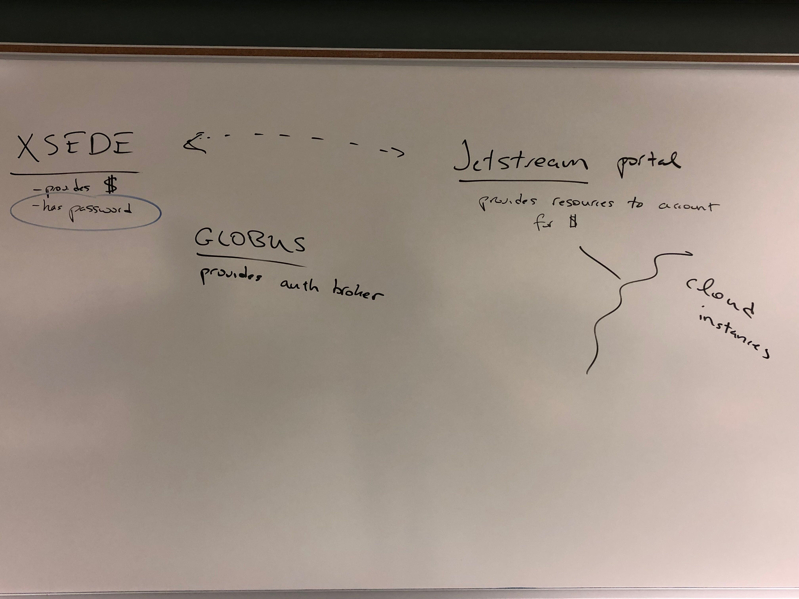

# Lab 3 lecture notes - GGG 201(b), 2019

[toc]

## Federated auth



## Miscellany

### Discourse

I've decided to use discourse for a lab help forum... for my own evil reasons, to be explained later. Anticipate an invite...

### Workshops!

I've scheduled two workshop, and the registration site is aliiiiive!

[Intro to data analysis in the shell and with R](https://registration.genomecenter.ucdavis.edu/events/intro_data_shell_R_jan_2019/) - next Wed 1/29, 9-noon.

[Intro to workflows for efficient automated data analysis, using snakemake](https://registration.genomecenter.ucdavis.edu/events/intro_snakemake_feb_2019/) - Wed Feb 27, 9-noon.

Please register for both of these in the next few hours, as I will open them up to others this afternoon :).

I am looking into rooms for an intro to UNIX shell on Monday, Feb 4th, 9-noon. Please let me know if that is a bad time for you. 

## Getting started

Start: boot an m1.medium instance using the latest GGG image on Jetstream.

Reminder of process:

* go to [use.jetstream-cloud.org/application](https://use.jetstream-cloud.org/application) and log in.
* the username is 'diblions' and the password is in a Canvas announcement.
* create a folder with your name in it under projects, then create a new instance.
    * find the GGG image under favorites
    * change the instance name to something like lab3
    * select m1.medium under instance size
    * click 'launch'
* ...wait.

## Accessing remote computer shell prompts, in general

Options:
* use the Guacamole Web console on Jetstream
* use RStudio on the Jetstream computer, if installed
* log in via ssh
    * use a private key
    * set a password some other way, then use a password

(All of these mechanisms access _the same computer_, and you can use all of them at once if you like...)

**The challenge**: Jetstream does not enable password login by default, because they don't actually know to your XSEDE account password! So if you want to use a password, you have to log in once to set your password first! (Chicken/egg...)

### To set your password:

Use the Jetstream Web shell to connect to a shell prompt. At the prompt on the remote computer, run:

```
sudo passwd diblions
```

and then enter your password twice. (Nothing will be printed to the screen.)

After that you can log in some other way (see below).

### Logging in with RStudio (recommended)

1. Open a Web browser and go to http://(address of remote machine):8787/, e.g. http://149.165.156.XXX:8787 - this will be different for each person.
2. Enter username 'diblions' and password (whatever you used above)
3. Voila! You should be running an RStudio Server.

Now, to get a shell prompt, go to the 'Tools...' menu and select 'Shell'. And you will see what looks like a shell prompt! Yay!

### Logging in with ssh.

If you are familiar with ssh, you can now log in to 'diblions@(machine address)', e.g. 'diblions@149.165.156.XXX'. On Mac OS X, the shell command would be 'ssh diblions@149.165.156.XXX'.

### Advanced: using a private key and skipping the password change.

If you are familiar with private keys, ask Titus to send you the `dibsi2018.pem` file. This will let you avoid all the password changing stuff above.

On Mac OS X, the shell command would be

```
ssh -i dibsi2018.pem diblions@149.165.156.XXX
```

### Note: accessing files via RStudio!

RStudio has a nice file browser. We'll be using that to look at file output!

## Running Trimmomatic!

Let's redo the last bits of lab 2, but this time with a friendlier copy/paste system...

Configure bioconda:

```
conda config --add channels defaults
conda config --add channels bioconda
conda config --add channels conda-forge
```

Install trimmomatic:

```
conda install -y trimmomatic
```

### Download some data and unpack it

Make a working directory:
```
mkdir ~/trim
cd ~/trim
```

Download some data:
```
curl -L https://osf.io/365fg/download -o nema_subset_0Hour.zip
curl -L https://osf.io/9tf2g/download -o nema_subset_6Hour.zip
```

Unpack the data:

```
unzip nema_subset_0Hour.zip
unzip nema_subset_6Hour.zip
```

and compress each file individually:

```
gzip *.fastq
```

You can also remove the .zip files:

```
rm *.zip
```

### Trim the data

(also see [the full ANGUS 2018 lesson](https://angus.readthedocs.io/en/2018/quality-and-trimming.html))

First, grab the TruSeq adapter sequences:
```
cp /opt/miniconda/pkgs/trimmomatic-*/share/trimmomatic-*/adapters/TruSeq2-PE.fa .
```

And now, run Trimmomatic:

```
trimmomatic PE 0Hour_ATCACG_L002_R1_001.fastq.gz \
        0Hour_ATCACG_L002_R2_001.fastq.gz \
        0Hour_ATCACG_L002_R1_001.qc.fastq.gz orphans_1 \
        0Hour_ATCACG_L002_R2_001.qc.fastq.gz orphans_2 \
        ILLUMINACLIP:TruSeq2-PE.fa:2:40:15 \
        LEADING:2 TRAILING:2 \
        SLIDINGWINDOW:4:2 \
        MINLEN:25
```

and you should see as output,

```
...
Input Read Pairs: 2500 Both Surviving: 2499 (99.96%) Forward Only Surviving: 0 (0.00%) Reverse Only Surviving: 1 (0.04%) Dropped: 0 (0.00%)
TrimmomaticPE: Completed successfully
```

Congratulations! You've run a real bioinformatics command :).

You can read more about Trimmomatic [here](http://www.usadellab.org/cms/?page=trimmomatic), or see the lesson page from ANGUS 2018, [here](https://angus.readthedocs.io/en/2018/quality-and-trimming.html).

Questions:

* what does the output mean?
* how would you adjust this to run on the next set of files?
* how many times do you need to run trimmomatic, given the files in this directory?
* what's with the file naming scheme we're using!?
* why is the output so messy and confusing!?

## Evaluating your data - looking at FastQC reports.

Let's take a look at a piece of software that will help you look at the quality of your data sets - FastQC.

()As usual, there's a longer & more detailed tutorial available [from ANGUS 2018](https://angus.readthedocs.io/en/2018/quality-and-trimming.html#fastqc).)

First, install fastqc:

```
conda install -y fastqc
```

Now, run it on a FASTQ GZ file:

```
fastqc 0Hour_ATCACG_L002_R1_001.fastq.gz
```
this will produce a file `0Hour_ATCACG_L002_R1_001_fastqc.html` that you can view on the Web via RStudio.

Try running FastQC on the other end of the paired-end data:

```
fastqc 0Hour_ATCACG_L002_R2_001.fastq.gz
```

To evaluate the effects of trimming, try running
FastQC on the output of trimmomatic -

```
fastqc 0Hour_ATCACG_L002_R1_001.qc.fastq.gz
```
 \- do you see any difference between the outputs?
 
This illustrates how to evaluate a single step of a workflow - basically, do a before and after comparison :).

For more information on FastQC, see [the FastQC page](https://www.bioinformatics.babraham.ac.uk/projects/fastqc).

See slide 39 and later of [this presentation](https://osf.io/mwt5n/) for some examples of really, really bad FastQC runs :)

## Doing things "the workflow way"

Now, instead of running trimming and FastQC manually, let's do them with the eelpond workflow.

(You can [read more about the eelpond workflow system here](https://github.com/dib-lab/eelpond/), and see some of [our research work with the protocol, here - Johnson et al., 2019, "Re-assembly, quality evaluation, and annotation of 678 microbial eukaryotic reference transcriptomes"](http://dx.doi.org/10.1093/gigascience/giy158).)

### Check out eelpond and necessary software.

First we have to get the eelpond workflow system:
```
cd ~/
git clone https://github.com/dib-lab/eelpond.git -b class/ggg201b
cd eelpond
```

Create and activate conda environment:

```
conda env create --file environment.yml -n eelpond-sw
conda activate eelpond-sw
```

### Configure eelpond.

Now generate an empty config file for eelpond:

```
./run_eelpond --build_config trim.yml trimmomatic
```

Edit `eelpond/trim.yml` (in e.g. RStudio) to look like this:

```
basename: lab3
samples: samples.tsv
```

And create `samples.tsv` like so using RStudio:

```
sample	unit	fq1	fq2	condition
0Hour	001	../trim/0Hour_ATCACG_L002_R1_001.fastq.gz	../trim/0Hour_ATCACG_L002_R2_001.fastq.gz	time0
6Hour	001	../trim/6Hour_CGATGT_L002_R1_001.fastq.gz	../trim/6Hour_CGATGT_L002_R2_001.fastq.gz	time6
```


### Run the preprocess workflow.

Now:

```
./run_eelpond trim.yml preprocess
```

and wait a few seconds. Now look at the output in `eelpond/lab3_out`. Do the files look familiar?

Next things:

* try rerunning the workflow. what happens?
* how can we force rerunning the workflow?
    * use 'touch' to change the modified dates of the input files: `touch ../trim/*.fastq.gz`
    * remove all of the outputs: `rm -fr lab3_out`

Important questions to answer (that we will probably answer later) --

* how do you change parameters??
* what's the full workflow??

## AT THE END: Cleaning up your Jetstream instance

Reminder! DELETE YOUR JETSTREAM INSTANCE before you leave.
