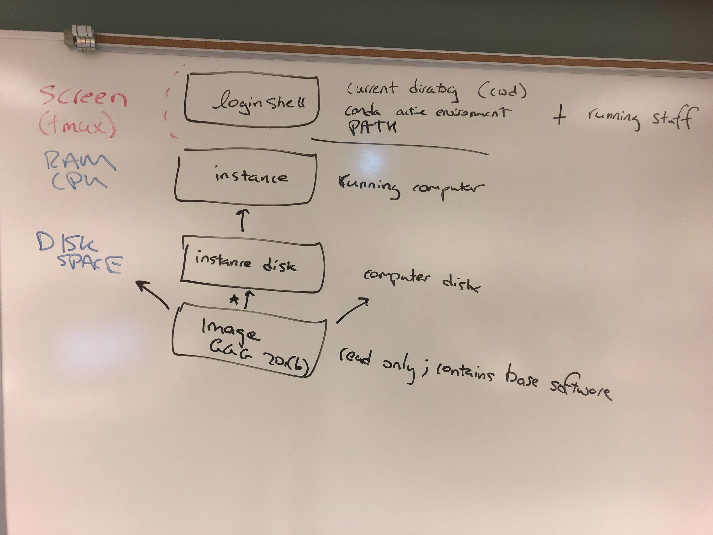

# Lab 4 lecture notes - GGG 201(b), 2019

[toc]

## HW #1

Due Tues, Feb 5 at 11pm PST. Please feel free to work together, but please run commands yourself and turn in separate google docs. Thank you!

1. Run the complete `default` workflow on the Nematostella data set (as specified in `eelpond/examples/nema.yaml`). See [Lab 3](https://hackmd.io/ZCX_8yx4QLOExT7dCjK3zQ?view) and the [eelpond full workflow docs](https://github.com/dib-lab/eelpond/blob/class/ggg201b/docs/eel_pond_workflow.md) for more details. Record all commands run (but not all the output!) in a new google doc.

2. Select an output transcript from the resulting `eelpond/lab3_out/assembly/lab3_trinity.fasta` and BLASTX it against NCBI nr on the NCBI Web site ([see BLASTX program at NCBI](https://blast.ncbi.nlm.nih.gov/Blast.cgi?PROGRAM=blastx&PAGE_TYPE=BlastSearch&LINK_LOC=blasthome)). Record the name, max score (aka bit score), and e-value of the top 2 hits in the same google doc as above. If you don't get any hits, record the failed transcript sequence in your google doc and then select a new transcript and try with that one.

3. Make your google doc readable by anyone with the URL (Share... Advanced... Change...) and then submit your google doc's URL via [this form](https://docs.google.com/forms/d/e/1FAIpQLSc_zNLe8Ar4MblI48RiM0qZjNC1MK3IF4Hz8G-NOq9ZOPfkVQ/viewform).

## Morning Lecture 1/29 

**Reconstruct the text** from the shotgun sequencing.

Outline:

* all fragments are from the same text
* paired-end sequences are separated by commas; they come from the same text, some distance apart;

Rules:

* no googling or programming please!
* use of a text editor is fine!

PDFs of the handouts are also available on canvas.

Questions to consider:

* what is/was your strategy? is it effective?
* is working in groups helpful or harmful? (and: if I gave you each 10 undergrads, would that help or hurt?)
* which are more useful, the long or short reads?
* does sorting the reads alphabetically help or hinder?
* how else might you scale to more data (if, for example, I gave you a whole book like this...)

note that this is the kind of data that all -omics depends on :)

Generate your own! http://teckla.idyll.org/~t/assembly-exercise/

* what strategies?
    * greedy
    * overlap-layout-consensus
    * word-based "pivot"
* _average_ coverage vs _actual_ coverage
* it helps that we know the language - imagine doing this in a language you didn't know!
* more data is not *necessarily* helpful without a good strategy... welcome to bioinformatics!
    * how do you deal with data with different errors, biases, etc?
* what strategies do you have for validation?
    * words? (k-mers)
    * sentences? (mapping)
    * "does it make sense" -> is that a good strategy?
    * (what kinds of errors might you expect?)
        * errors vs variants
        * how do you deal with repeats?
    * do you use all the data?
        * internal validation vs external validation
        * same samples / technical
        * different samples / biological

## Data type musings

More fundamental q: is there sufficient information to reconstruct the true text?

* Types of samples and assumptions
    * genomics: ~single genome
    * rnaseq: ~single genome, multiple splice variants
    * metagenomics: ~multiple genomes, multiple strain variants
* assumptions of clonality
* Types of data / information content
    * short reads
    * long reads
    * 10x
    * long range scaffolding
    * hi-c / contacts
* Errors and types of errors in data and effects
* Types of errors in assemble

## Data uses in bioinfo

this is shotgun sequencing: assumption of even sampling of nucleotide content.

fundamentally, three strategies for making use of shotgun sequencing:

* assembly
    * construct new seqeunce!
    * assumption of ~little strain variation
* mapping
    * reference dependent / biased
* quantification
    * assumptions about coverage/sampling rate

# Lab 4, in actuality!



### Run lab3 workflow bit

run the lab 3 bit first:

[download some data](https://hackmd.io/ZCX_8yx4QLOExT7dCjK3zQ?view#Download-some-data-and-unpack-it)

[run workflow](https://hackmd.io/ZCX_8yx4QLOExT7dCjK3zQ?view#Doing-things-%E2%80%9Cthe-workflow-way%E2%80%9D)

### Side note

Here's what you need to do every time you log in and want to run eelpond:

```
conda config --add channels defaults
conda config --add channels bioconda
conda config --add channels conda-forge

export PATH=$PATH:/opt/miniconda/bin
conda activate eelpond-sw
```

we'll talk more about why a bit later today.

### Side note 2

Start screen:

```
screen
```

resume screen with:

```
screen -dr
```

I recommend running everything in screen.

### What did we do in lab3?

[Here](https://hackmd.io/ZCX_8yx4QLOExT7dCjK3zQ?view#Doing-things-%E2%80%9Cthe-workflow-way%E2%80%9D), we configured and ran the `preprocess` workflow.

What's going on here?

A few things --

first, we "clone" (copy) the eelpond software from github, the web site we use to develop software. [[link]](https://github.com/dib-lab/eelpond/)

second, we create and activate a conda environment named `eelpond-sw` that has all the necessary software to run eelpond, specified in [environment.yml](https://github.com/dib-lab/eelpond/blob/master/environment.yml).

third, we generate an empty configuration file for the trimmomatic step, and configure the two necessary things: the name of our analysis, and the sample information.

Then we run `run_eelpond`. This:

* loads the software for each step, e.g. [rules/trimmomatic/trimmomatic-env.yaml](https://github.com/dib-lab/eelpond/blob/master/rules/trimmomatic/trimmomatic-env.yaml)
* looks at the config file (`trim.yml`) and sample file specified therein
* copies in the data as specified from `../trim`
* runs fastqc on the two sample files
* runs trimmomatic on the two sample files
* runs fastqc on the two trimmed files
* puts all the results under `lab3_out/`

all in all this is 15 steps - 

(Note to Titus: go through output!)

### Running a complete workflow

Now let's run a complete assembly workflow!!

Generate config file `lab4.yml`:

```
./run_eelpond --build_config lab4.yml default
```

Edit the top to look like:

```
basename: lab4
experiment: _exp1
samples: examples/nema.samples.tsv
```
without removing any of the stuff on the bottom.

Also change `download_data` to `true`.

Now make a new copy of the config file:

```
cp lab4.yml lab4-exp2.yml
```
and edit that file to change `experiment` to be `_exp2`.

Let's ALSO tweak a parameter - find the `SLIDINGWINDOW` text in `lab4-exp2.yml`, and change it to `SLIDINGWINDOW:4:30`.

Now run them both:

```
./run_eelpond lab4.yml -t 6
./run_eelpond lab4-exp2.yml -t 6
```
note here that we are giving permission to snakemake, the workflow system underneath eel pond, to run up to six processes at a time. (The `-t` stands for 'threads'.)

## Details

### What is being run?

The default eel-pond approach is documented in some detail [here](https://eel-pond.readthedocs.io/en/latest/), and the version implemented in this workflow consists of the following steps:

1. read quality score trimming (with Trimmomatic)
2. k-mer abundance trimming (with khmer)
3. de novo RNAseq assembly (with Trinity)
4. annotation (with dammit)
5. transcript quantification (with salmon)
6. differential expression analysis (with deseq2)

(draw diagram)

### How many tasks are run as part of this workflow?

Quite a few ;). There are 5 samples for each of two time points, and each sample has two types of trimming and one FastQC - that's 30 steps right there. Then we're also running quantification analysis, which is another 10. There are also some internal processing steps that are applied to each sample. Overall, `run_eelpond` runs over 100 steps.

You can get a full explanation of the workflow by looking at the report under the output directory, e.g. in `logs/report.html`.

If you weren't using a workflow system, you'd have to run all of these by hand or write a script to run all of them.

### What is the output of this workflow??

First, all of the output goes into the subdirectory `{basename}_{experiment}_out/`. The `basename` and `experiment` are taken directly from the config file.

For example, the first config above created `lab4_exp1_out/`. There is lots of output in there! Take a look by running -- you should see:

```
annotation  assembly  input_data  logs  preprocess  quant  sourmash
```

Some of these should be self-explanatory - for example, the `input_data/` subdirectory contains the original read data sets, the `preprocess/` directory contains the output of read preprocessing, and the `assembly/` directory contains the output of the assembler.

We'll look at some of the rest as we go on.

### Did it work???

Check out `lab4_out_exp1/assembly/lab4_trinity.fasta` in RStudio.

Take one the FASTA sequences from this file and [go BLASTX it against all known proteins](https://blast.ncbi.nlm.nih.gov/Blast.cgi).

Does it look real??? What is it??? Isn't this exciting??????

(c'mon. It's really exciting!)

### What is the `experiment` for in the config YAML file?

Above, in `lab4-exp2.yml` we changed the trimming parameters used by Trimmomatic away from the default, and then we changed `experiment` to `_exp2`.

When we ran `lab4-exp2.yml` we created the new directory `lab4_exp2_out`. This directory contains the results of the entire workflow, *running on the differently trimmed reads*.

Why a new directory?

Since we're changing the processing of the input reads, virtually *everything* could be different between the two runs! So we want to put the results in a different place so we can compare them.

That's what the `experiment` parameter is for.

### What is this "yaml" or "yml" file and the YAML format??

YAML is "yet another markup language" and it's useful for configuration files where you want the file to be human readable but also something the computer can understand. You can read more about it [on Wikipedia](https://en.wikipedia.org/wiki/YAML).

We use YAML because it's a fairly simple way to make a lot of parameters available to be changed in one place.

### Restarting and rerunning this workflow

Suppose you want to rerun the trinity assembly because you updated an assembly parameter. How would you do that?

If you just try rerunning things, nothing will happen:

```
./run_eelpond lab4.yml trinity
```

This is because eelpond has already run everything: it will look at the current output files, see that it's all there, shrug, and exit.

()Ideally, eelpond would notice that you'd changed the assembly parameters and rerun things, but that's not done currently.)

How do you *force* rerunning?

Well, the easiest way is to actually remove the files you want to regenerate:

`rm -r lab4_out_exp1/assembly/` will remove the current assembly. Now, eelpond will re-run the assembly.

Give it a try:

```
rm -r lab4_out_exp1/assembly/
./run_eelpond lab4.yml trinity
```

### It's workflows all the way down...

Here I should note that the Trinity assembler itself runs a lot of different programs, as does the dammit annotator. Both of them are _also_ workflow programs.

So we have a workflow (eelpond) running two other workflows (Trinity and dammit). [It's workflows all the way down](https://en.wikipedia.org/wiki/Turtles_all_the_way_down).

You would not be wrong to conclude that bioinformatics is basically about running many, many individual programs... and then doing that many, many different times with different parameters...

### Some final thoughts.

The whole point of all of these shenanigans is to generate the output files - for HW 1, the important file is the `lab4_out_exp1/assembly/lab4_trinity.fasta` file, which contains the actual de novo transcriptome assembly.

You may think it's overcomplicated. And ...yes, it is. But if you go back and really look at what we've been doing, at the top level it's:

* tell eelpond where your input files are;
* tell eelpond what to name stuff;
* run!

...and, in theory at least, it all Just Works.

This begs a new, exciting question: what do you do if an established workflow system doesn't exist for your analysis?

A few thoughts --

* you don't *need* to use a workflow system. It's just a good idea. You can write all the commands down yourself and keep them in a text file or a Word document and copy/paste them. (I recommend a hackmd like this, incidentally, because then you can add commentary.)

* start small, and then "grow" your workflow as you get the initial steps working. If you try to do it all at once you'll break your brain.

* It's actually surprisingly easy to write a workflow in a system like [snakemake](https://snakemake.readthedocs.io/en/stable/) and that's what I'll be showing (some of) you on Feb 27th in a [Wednesday workshop](https://registration.genomecenter.ucdavis.edu/events/intro_snakemake_feb_2019/).

* eelpond itself is more complicated than a basic snakemake workflow because we're trying to make it *general* and *configurable*. Strip away all of that complexity and what you're left with is:
    * software install of specific versions using bioconda
    * specifying what commands to run, and how they interact
    * reporting on the output

  which is something you'll want to do no matter what workflow(s) or commands you're running.
